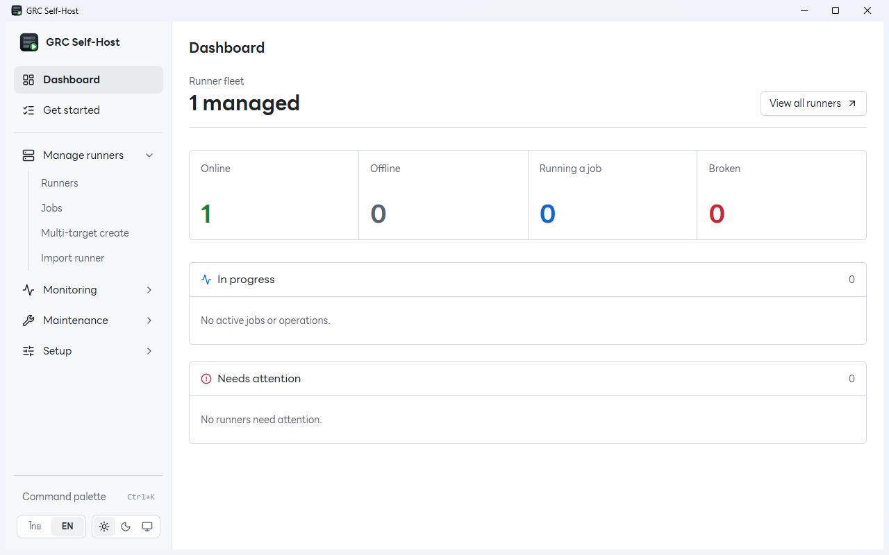
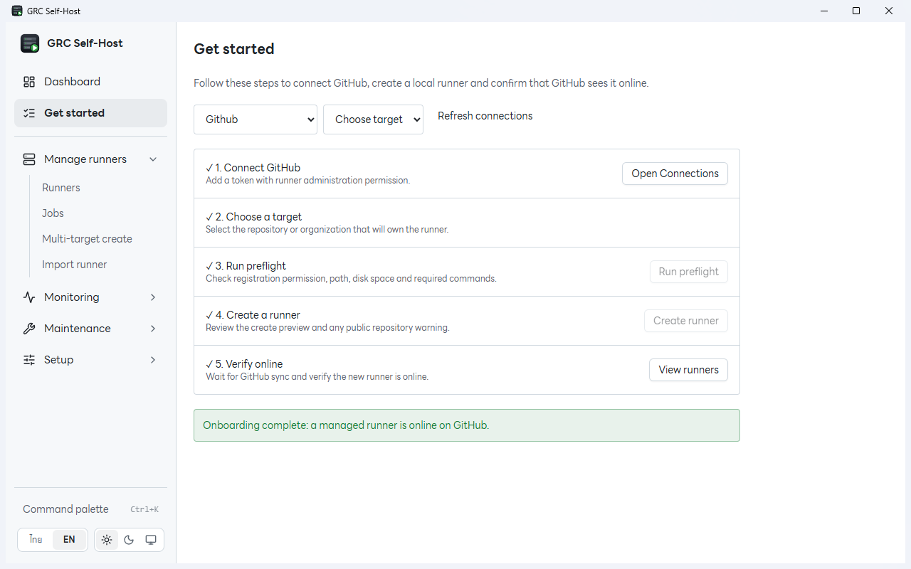
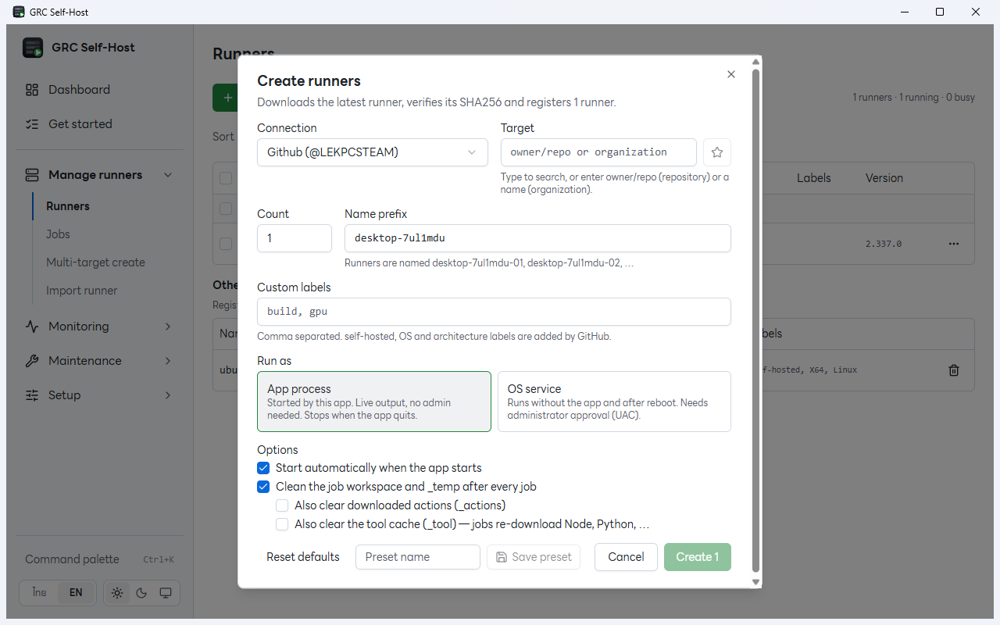
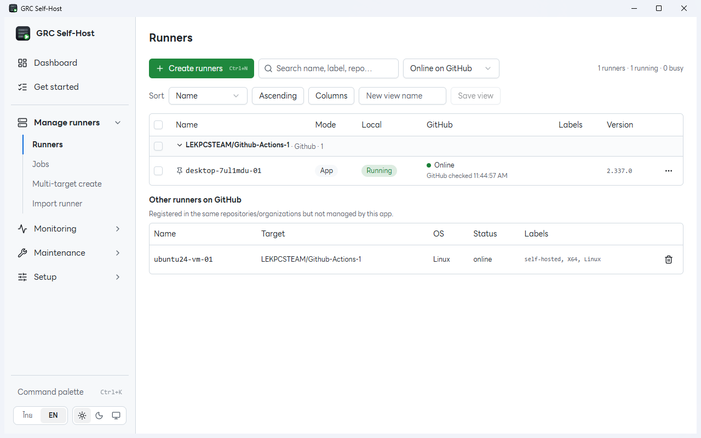
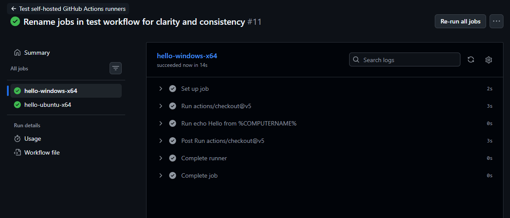

# GRC Self-Host

GRC Self-Host is a desktop app for creating and managing GitHub Actions self-hosted runners on your own machine. It lets you run multiple runners for repositories or organizations from one place.

## What it does

- Creates and registers runners with GitHub, including multiple runners at once.
- Starts, stops, and restarts runners; shows their local and GitHub status.
- Lets runners run as app processes or OS services.
- Provides logs, diagnostics, job history, cleanup options, and maintenance tools.

## Why use it

You can manage several runners without installing and configuring each one by hand. The dashboard shows which runners are online, busy, or need attention, while the runner list gives you one place to operate them. Reusable presets make repeated setups quicker.

## How to use it

1. Open **Get started**, then add a GitHub fine-grained personal access token in **Setup → Connections**. Grant **Administration: Read and write** for repository runners or **Self-hosted runners: Read and write** for organization runners.
2. Select the repository or organization and run **Preflight** to check permissions and local requirements.
3. Choose **Create runner**. Set the count, name prefix, labels, and run mode. **App process** runs while the app is running; **OS service** keeps running independently and requires administrator approval to install.
4. Confirm the creation preview. The app downloads and verifies the runner package, then registers the runner with GitHub.
5. Open **Runners** and confirm its GitHub status is **Online**. Use that runner's labels in a GitHub Actions workflow, then monitor jobs and logs in the app.

Self-hosted runners execute workflow code on your machine. Only allow trusted users and workflows to use them, especially in public repositories.

## Screenshots











## Run from source

Requires Node.js 24.21.0 or newer and pnpm 11.25.0 or newer.

```powershell
pnpm install
pnpm start
```
